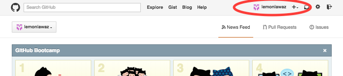
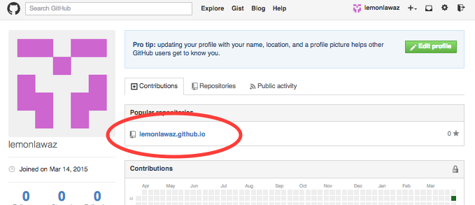
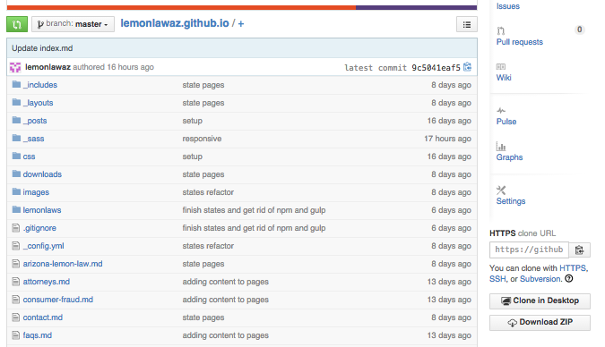
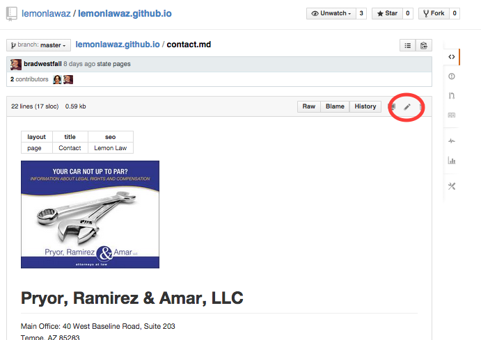
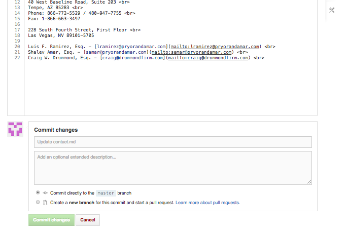

# Site Edits

This site can be edited directly on GitHub. Most pages for the site are going to be markdown files with a `.md` file extension. Some pages are HTML files with a `.html` extension.

### Login

First, login to GitHub and you'll see your username at the top. Click the username



### Find the repository (the website)

Click the repo for `lemonlawaz.github.io`



### Choose files to work on

Here is where you'll see all the files in your website (the Markdown and HTML files included)



The state-specific files are located in the `lemonlaws` folder. Any file named "index" is the main file of that given section. So for instance the `index.md` file on the list above is the home page. In the `lemonlaws` folder, the `index.md` file is the main file for states.

### View a file

When you view a file you'll get a page that looks like this image. Click the pencil icon to edit the file.



When you're done editing, click the "Commit Changes" button at the bottom of the page:



# Using Markdown

These instructions will show you how to make basic edits

## Paragraphs

When you write paragraph information, make sure each paragraph has a blank space around it:

```md
paragraph one

paragraph two
```

Without the blank space, the two paragraphs will be merged into one.

## Headings

If you want headings, use a pound sign `#` in front of the heading like this

```md
# Here is the heading

Here is the paragraph
```

## Stylized Text

To make text bold use two asterisks around the text:

```md
Here is some non-bold text, **Here is some bold text**
```

## Bullets

Use hyphens to make bullets. Put a tab before a hyphen to make nested bullets:

```md
- One
- Two
  - Sub One
  - Sub Two
```

The above markdown will produce:

- One
- Two
  - Sub One
  - Sub Two
